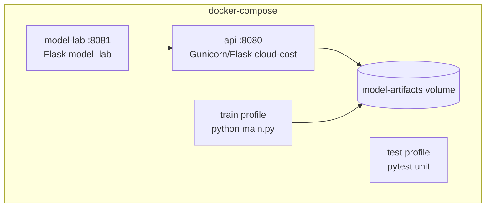

# Containers

| Service | Image | Ports | Role |
|---------|-------|-------|------|
| `api` | `cloud-cost-api:latest` | 8080 | Inference from CAS HEAD |
| `model-lab` | same image | 8081 | Trial election |
| `train` | profile | — | Re-train into volume |
| `test` | profile | — | Unit tests |
