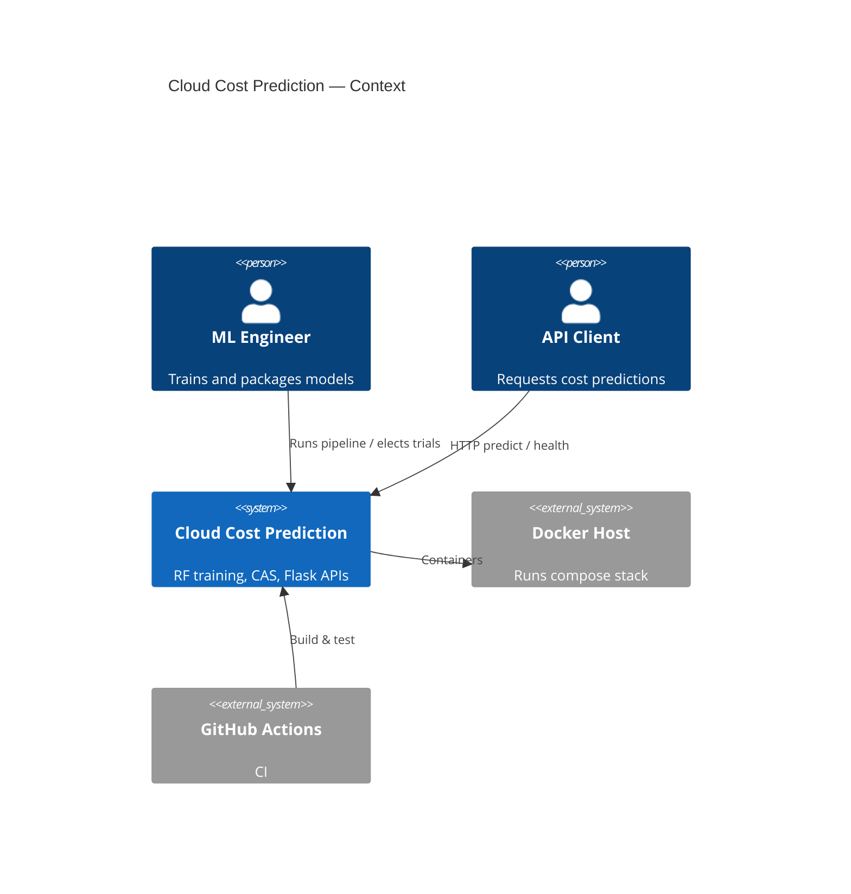

# System context

## External actors

| Actor | Interaction |
|-------|-------------|
| ML Engineer | `main.py`, model_lab CLI, Compose train profile |
| API Client | HTTP JSON / form posts |
| CI | Checkout, pytest, train smoke, docker build |

No cloud billing APIs are integrated yet.
