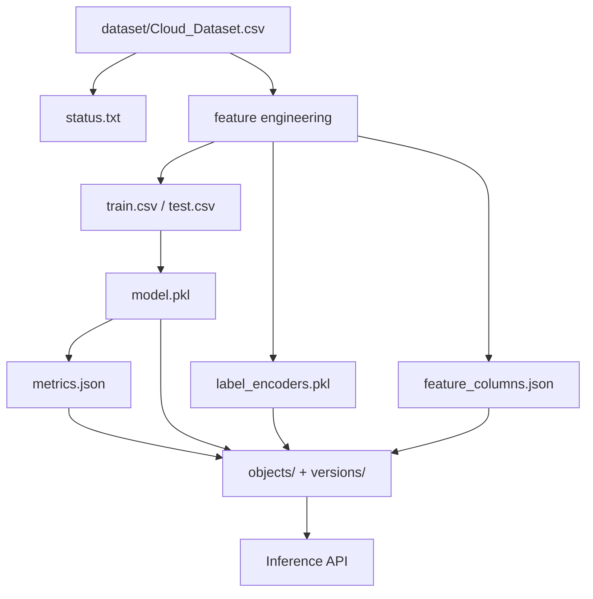

# Data flow

```mermaid
flowchart TD
  RAW[dataset/Cloud_Dataset.csv] --> V[status.txt]
  RAW --> FE[feature engineering]
  FE --> TR[train.csv / test.csv]
  FE --> ENC[label_encoders.pkl]
  FE --> FC[feature_columns.json]
  TR --> RF[model.pkl]
  RF --> MET[metrics.json]
  RF --> CAS[objects/ + versions/]
  ENC --> CAS
  FC --> CAS
  MET --> CAS
  CAS --> INF[Inference API]
```

Digests of inputs/code land in `artifacts/.pipeline/<stage>.json` to decide skip vs re-run.
