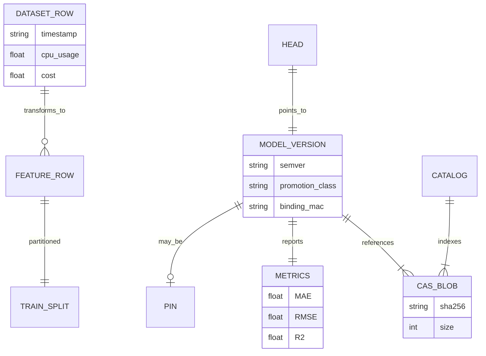

# Logical data model / ERD

`catalog.sqlite` is rebuilt on each successful publish (WAL). Not a long-lived OLTP schema for product data.

> **GAP:** No persistent product DB for users, API keys, or billing events.
