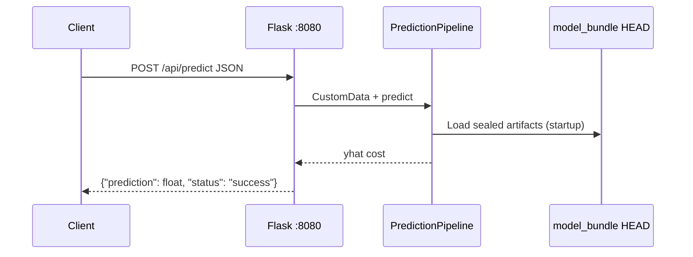
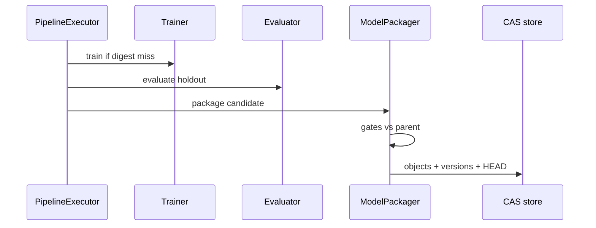

# Sequence — prediction

```mermaid
sequenceDiagram
  participant C as Client
  participant A as Flask :8080
  participant P as PredictionPipeline
  participant CAS as model_bundle HEAD
  C->>A: POST /api/predict JSON
  A->>P: CustomData + predict
  P->>CAS: Load sealed artifacts (startup)
  P-->>A: yhat cost
  A-->>C: {"prediction": float, "status": "success"}
```

## Sequence — packaging (happy path)

```mermaid
sequenceDiagram
  participant E as PipelineExecutor
  participant T as Trainer
  participant Ev as Evaluator
  participant M as ModelPackager
  participant S as CAS store
  E->>T: train if digest miss
  E->>Ev: evaluate holdout
  E->>M: package candidate
  M->>M: gates vs parent
  M->>S: objects + versions + HEAD
```
