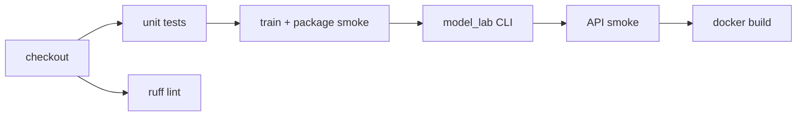

# CI/CD

GitHub Actions `.github/workflows/ci.yml`:

```mermaid
flowchart LR
  A[checkout] --> B[unit tests]
  B --> C[train + package smoke]
  C --> D[model_lab CLI]
  D --> E[API smoke]
  E --> F[docker build]
  A --> G[ruff lint]
```

Triggers: push to `main`/`master`, pull requests. Python 3.13, installs `regina-rexx`.

No CD promotion to a hosted environment yet.
