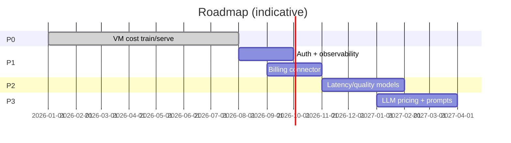

# Portfolio roadmap

## Now — harden the lab platform

- Keep CAS + digests + CI green
- Authn spike, structured logs
- Baseline model comparison table

## Next — FinOps data reality

- Ingest sample billing exports
- Prediction vs actual reports
- DQ + drift monitors (log-only)

## Later — LLM intelligence

- Rate cards + tokenization
- Latency & quality models
- Prompt optimization + recommendations

Dates are portfolio planning aids, not commitments.
