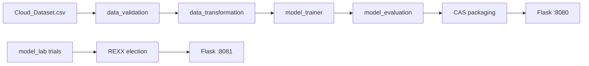

# Engineering Research Portfolio

Portfolio documentation for the **Cloud Cost Prediction** platform: a FinOps / MLOps system that trains a RandomForest cost model, packages it into an immutable CAS store, serves inference on Flask, and elects RandomForest trials via REXX Borda/Copeland voting.

This tree separates **IMPLEMENTED NOW** from **PLANNED / GAP** so research expansion into LLM cost, latency, and quality intelligence stays honest.

| Field | Value |
|-------|-------|
| Portfolio root | `docs/` |
| Last updated | 2026-08-09 |
| Primary code | `cloud-cost/`, `model_lab/` |
| Inference | `:8080` |
| Model lab | `:8081` |

## Section index

| # | Section | Status | Index |
|---|---------|--------|-------|
| 00 | Vision | Partial | [00-vision](00-vision/README.md) |
| 01 | Research | Partial / Gap | [01-research](01-research/README.md) |
| 02 | Product | Partial | [02-product](02-product/README.md) |
| 03 | Architecture | Implemented / Partial | [03-architecture](03-architecture/README.md) |
| 04 | Machine learning | Implemented + Gap | [04-machine-learning](04-machine-learning/README.md) |
| 05 | Data engineering | Implemented / Partial | [05-data-engineering](05-data-engineering/README.md) |
| 06 | API | Implemented / Gap | [06-api](06-api/README.md) |
| 07 | Infrastructure | Partial / Gap | [07-infrastructure](07-infrastructure/README.md) |
| 08 | Experiments | Partial | [08-experiments](08-experiments/README.md) |
| 09 | Benchmarks | Partial / Gap | [09-benchmarks](09-benchmarks/README.md) |
| 10 | ADRs | Implemented | [10-adrs](10-adrs/README.md) |
| 11 | Risks | Partial | [11-risks](11-risks/risk-register.md) |
| 12 | Weekly reviews | Partial | [12-weekly-reviews](12-weekly-reviews/README.md) |
| 13 | Roadmap | Planned | [13-roadmap](13-roadmap/README.md) |
| — | Assets | Placeholder | [assets](assets/README.md) |

## Implemented system (summary)

- **Model:** `sklearn.ensemble.RandomForestRegressor` predicting VM `cost`
- **Pipeline:** `data_validation` → `data_transformation` → `model_trainer` → `model_evaluation` → CAS `model_packaging`
- **Re-runs:** Git blob SHA-256 digests under `artifacts/.pipeline/`; unchanged stages skip
- **CAS store:** `HEAD`, `pins.json`, `RELEASES`, `catalog.sqlite`, `objects/`, `versions/`
- **APIs:** Flask inference (`/health`, `/predict`, `/api/predict`) on **8080**; model_lab election (`/health`, `/api/select`) on **8081**
- **Ops:** Docker, docker-compose, GitHub Actions CI
- **Holdout (observed):** MAE ≈ 0.00116, RMSE ≈ 0.00182, R² ≈ 0.999 — **caveat:** ~1000-row synthetic `Cloud_Dataset.csv`

## Gap Register (top-level)

> Every item below is **not** implemented (or only sketched). See section docs for next actions.

1. LLM token / request pricing intelligence (provider rate cards, cache/discount modeling)
2. Tokenization cost attribution and prompt→token estimators
3. Latency-prediction model (p50/p95/p99) beyond raw feature `latency_ms`
4. Quality / usefulness prediction for LLM responses
5. Recommendation engine for VM / region / model routing
6. Prompt optimization loop (auto rewrite / few-shot selection)
7. Production OpenAPI codegen + typed SDKs (Python/TS)
8. Outbound webhooks / event bus for publish & election events
9. Paid competitor teardown with primary-source pricing data
10. Production observability stack (Prometheus/OTel, dashboards, SLOs)
11. Alerting routes (PagerDuty/Slack) with runbook links
12. Disaster-recovery runbooks with proven RTO/RPO drills
13. Real FinOps CUR/BigQuery billing ingestion (vs synthetic CSV)
14. AuthN/AuthZ, rate limiting, and multi-tenant isolation on APIs
15. Online feature store + training/serving skew monitors
16. Model monitoring / drift detection in production
17. Multi-model serving (canary, shadow, A/B) beyond HEAD pin
18. Horizontal autoscaling / K8s manifests (compose-only today)
19. Formal threat-model review with residual risk sign-off
20. Public paper / blog artifacts and external references curation completeness

## How to read status labels

| Status | Meaning |
|--------|---------|
| **Implemented** | Code + artifacts exist and are exercised by CI or local runs |
| **Partial** | Some pieces exist; gaps called out inline |
| **Planned** | Intentionally designed, not built |
| **Gap** | Research or product hole; needs next actions |

## Related code docs

- [`cloud-cost/docs/model_bundle_contract.md`](../cloud-cost/docs/model_bundle_contract.md) — CAS packaging contract
