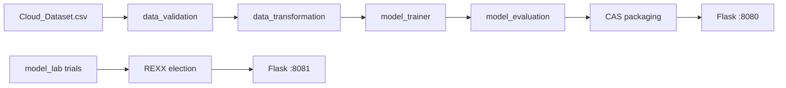

# Engineering Research Portfolio

Portfolio documentation for the **Cloud Cost Prediction** platform: a FinOps / MLOps system that trains a RandomForest cost model, packages it into an immutable CAS store, serves inference on Flask, and elects RandomForest trials via REXX Borda/Copeland voting.

**Near-term focus:** cloud-server cost prediction reliability, observability, and infrastructure — not LLM tokens/prompts.

This tree separates **IMPLEMENTED NOW** from **PLANNED / GAP**.

| Field | Value |
|-------|-------|
| Portfolio root | `docs/` |
| Last updated | 2026-08-10 |
| Primary code | `cloud-cost/`, `model_lab/` |
| Inference | `:8080` |
| Model lab | `:8081` |

## Section index

| # | Section | Status | Index |
|---|---------|--------|-------|
| 00 | Vision | Partial | [00-vision](00-vision/README.md) |
| 01 | Research | Partial / Gap | [01-research](01-research/README.md) |
| 02 | Product | Partial | [02-product](02-product/README.md) |
| 03 | Architecture | Implemented / Partial | [03-architecture](03-architecture/README.md) |
| 04 | Machine learning | Implemented + Gap | [04-machine-learning](04-machine-learning/README.md) |
| 05 | Data engineering | Implemented / Partial | [05-data-engineering](05-data-engineering/README.md) |
| 06 | API | Implemented / Gap | [06-api](06-api/README.md) |
| 07 | Infrastructure | Partial / Gap | [07-infrastructure](07-infrastructure/README.md) |
| 08 | Experiments | Partial | [08-experiments](08-experiments/README.md) |
| 09 | Benchmarks | Partial / Gap | [09-benchmarks](09-benchmarks/README.md) |
| 10 | ADRs | Implemented | [10-adrs](10-adrs/README.md) |
| 11 | Risks | Partial | [11-risks](11-risks/risk-register.md) |
| 12 | Weekly reviews | Partial | [12-weekly-reviews](12-weekly-reviews/README.md) |
| 13 | Roadmap | Planned | [13-roadmap](13-roadmap/README.md) |
| — | Assets | Placeholder | [assets](assets/README.md) |

## Implemented system (summary)

- **Model:** `sklearn.ensemble.RandomForestRegressor` predicting VM `cost`
- **Pipeline:** `data_validation` → `data_transformation` → `model_trainer` → `model_evaluation` → CAS `model_packaging`
- **Re-runs:** Git blob SHA-256 digests under `artifacts/.pipeline/`; unchanged stages skip
- **CAS store:** `HEAD`, `pins.json`, `RELEASES`, `catalog.sqlite`, `objects/`, `versions/`
- **APIs:** Flask inference (`/`, `/estimate`, `/health`, `/ready`, `/metrics`, `/predict`, `/api/predict`) on **8080**; model_lab election on **8081**
- **UI:** Corporate overview for non-technical users + estimate wizard
- **MLOps:** temporal split, train/serve parity tests, batch predict, feature-schema snapshot, OOB drift metrics, MLflow params/gaps, canary/shadow hooks, CI metrics gate
- **Ops:** Docker/Compose, CI, Prometheus/Grafana (`--profile obs`), prediction cache, default rate limits, optional `API_KEY`
- **Holdout (temporal, observed):** MAE ≈ 0.00126, R² ≈ 0.9987 — **caveat:** ~1000-row synthetic `Cloud_Dataset.csv`
- **Your checklist:** [USER_ACTIONS.md](USER_ACTIONS.md)

## Gap Register (top-level)

> Items marked **Partial** have a working foundation in-repo; remaining work is called out in section docs.
> LLM token/prompt items are explicitly **deferred** (out of current cloud-server scope).

| # | Item | Status |
|---|------|--------|
| 1 | LLM token / request pricing intelligence | Deferred |
| 2 | Tokenization / prompt→token estimators | Deferred |
| 3 | Latency-prediction model (beyond feature `latency_ms`) | Gap |
| 4 | Quality / usefulness prediction (LLM) | Deferred |
| 5 | Recommendation engine (VM / region routing) | Gap |
| 6 | Prompt optimization loop | Deferred |
| 7 | OpenAPI codegen + typed SDKs | Gap |
| 8 | Outbound webhooks / event bus | Gap |
| 9 | Paid competitor teardown with primary data | Gap |
| 10 | Observability (JSON logs, `/metrics`, `/ready`, Prometheus + Grafana profile) | **Partial** — OTel/SLO burn/log aggregation remain |
| 11 | Alerting (checked-in Prometheus rules; no pager routes) | **Partial** — Alertmanager/Slack/PagerDuty remain |
| 12 | Disaster recovery (CAS backup/restore + CI drill) | **Partial** — offsite/multi-AZ remain |
| 13 | Real FinOps CUR/BigQuery billing ingestion | Gap |
| 14 | AuthN/AuthZ, rate limiting, multi-tenant isolation | **Partial** — optional `API_KEY` + Compose default rate limit; no multi-tenant AuthZ |
| 15 | Online feature store + train/serve skew monitors | **Partial** — local schema snapshot + parity tests; not Feast |
| 16 | Model monitoring / drift detection | **Partial** — OOB Prometheus + alert; no online label residuals |
| 17 | Multi-model serving (canary/shadow/A/B) | **Partial** — CAS probe + `SERVING_MODE`; needs dual pins in prod |
| 18 | Kubernetes / HPA (Compose-only today) | Gap |
| 19 | Formal threat-model residual-risk sign-off | **Partial** — draft + mitigations updated; formal sign-off open |
| 20 | External papers / references curation completeness | Gap |

## How to read status labels

| Status | Meaning |
|--------|---------|
| **Implemented** | Code + artifacts exist and are exercised by CI or local runs |
| **Partial** | Some pieces exist; gaps called out inline |
| **Planned** | Intentionally designed, not built |
| **Gap** | Research or product hole; needs next actions |

## Related code docs

- [`cloud-cost/docs/model_bundle_contract.md`](../cloud-cost/docs/model_bundle_contract.md) — CAS packaging contract
